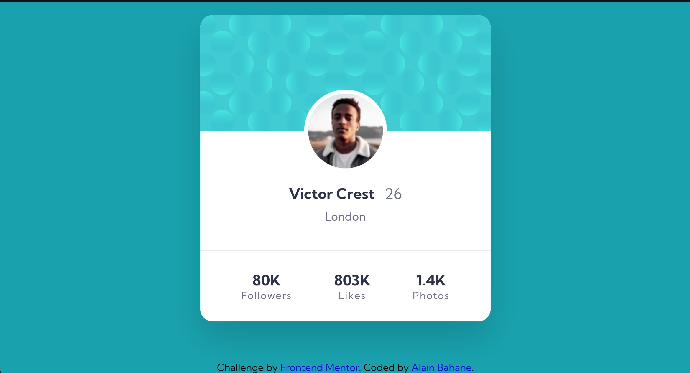

# Frontend Mentor - Profile card component solution

This is a solution to the [Profile card component challenge on Frontend Mentor](https://www.frontendmentor.io/challenges/profile-card-component-cfArpWshJ). Frontend Mentor challenges help you improve your coding skills by building realistic projects. 

## Table of contents

- [Overview](#overview)
  - [The challenge](#the-challenge)
  - [Screenshot](#screenshot)
  - [Links](#links)
- [My process](#my-process)
  - [Built with](#built-with)
  - [What I learned](#what-i-learned)
  - [Continued development](#continued-development)
  - [Useful resources](#useful-resources)
  - [AI Collaboration](#ai-collaboration)
- [Author](#author)
- [Acknowledgments](#acknowledgments)

## Overview

### The challenge

- Build out the project to the designs provided

### Screenshot

### Links

- Solution URL: https://github.com/FreeDev-Group/Profile-Card-Component-Alain.git  
- Live Site URL: (add your live site link here)

## My process

### Built with

- Semantic HTML5 markup  
- CSS custom properties  
- Flexbox  
- Mobile-first workflow  

### What I learned

- How to center elements using Flexbox  
- How to position elements like the avatar correctly  
- How to structure a clean and organized HTML layout  
- How to use CSS variables to manage colors  

### Continued development

- Improve responsive design skills  
- Better mastery of Flexbox and layout techniques  
- Writing cleaner and more maintainable CSS  
- Practicing more real-world UI components  

### Useful resources

- Frontend Mentor challenge: https://www.frontendmentor.io  
- MDN Web Docs: https://developer.mozilla.org  

### AI Collaboration

- I used ChatGPT to help debug my layout and Git workflow  
- I used AI to better understand how to structure Git branches and commits  
- AI helped me improve my workflow and clean my code organization  

## Author

- Frontend Mentor - [@alainbahanep](https://www.frontendmentor.io/profile/alainbahanep)  
- GitHub - https://github.com/FreeDev-Group/Profile-Card-Component-Alain  

## Acknowledgments

Acknowledgement:  
- My mentor Salomon Mwilo  
- FreeDev Group